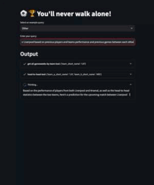

# ⚽️⚡️ Fantasy Premier League AI Agent

## Introduction

👨‍🔬 FPL Agent is an **experimental** AI Agent designed to provide insights and answers to your Premier League queries. Powered by Langchain and integrated with the [Anfield GraphQL API](https://github.com/margostino/anfield-api), this agent leverages [LLMs](https://en.wikipedia.org/wiki/Large_language_model) to fetch and analyze Premier League data. Deployed on Streamlit, it offers an intuitive and user-friendly interface for all Premier League enthusiasts.



### Features

**Data-Driven Insights:** 

Get accurate, real-time information about Premier League players and teams.

**Improved Predictions:** 
Utilize advanced reasoning to make better predictions about player performances.

**Enhanced User Experience:** 

Streamlined prompts and Streamlit components for an intuitive and efficient user interface.

## Usage

The app is live here: [FPL Agent on Streamlit](https://fpl-agent.streamlit.app/):
1. 🔑 Enter your **OpenAI** and **Anfield** API Keys. These keys are necessary to fetch data and run the AI agent.
2. ❓Ask Questions: Use the AI agent to get insights about Fantasy Premier League players and teams.

## Local Development

### Prerequisites
- Python 3.9 or later
- Poetry for dependency management
- An OpenAI API Key
- An Anfield API Key (Free - Reach out to me [here](https://github.com/margostino/fpl-agent) and I can create one key for you. This API is using a key just to game more granular control since the data is public)

### Installation Steps
1. **Clone the Repository**

```bash
git clone git@github.com:margostino/fpl-agent.git
cd fpl-agent
```

2. **Install Dependencies**

```bash
poetry install
```

3. **Set Up API Keys**

Locally you can set up the API keys as environment variables.

4. **Run the Application**

```bash
streamlit run src/main.py
```


## Future Features
- **Enhanced Predictions**: Implement more sophisticated reasoning prompting.
- **Prompt Improvement**: Focus on refining prompts to reduce redundancy and ambiguity, ensuring clearer and more precise queries.
- **Streamlit Component Enhancements**: Develop components with auto-cleanup capabilities to streamline the user experience.
- **Data Visualization**: Integrate advanced visualization tools for more interactive and insightful data presentations.

## Demo
Watch a live demonstration of the Fantasy Premier League AI Agent in action: [Demo Video](https://youtu.be/Droy_TUx_O4)

---

For more information or assistance, feel free to create an issue in the [GitHub Repository](https://github.com/margostino/fpl-agent).

# Support
For support, issues, or contributions, please visit our GitHub repository.

# License

FPL Agent is licensed under the [MIT license](https://github.com/margostino/fpl-agent/blob/master/LICENSE)
